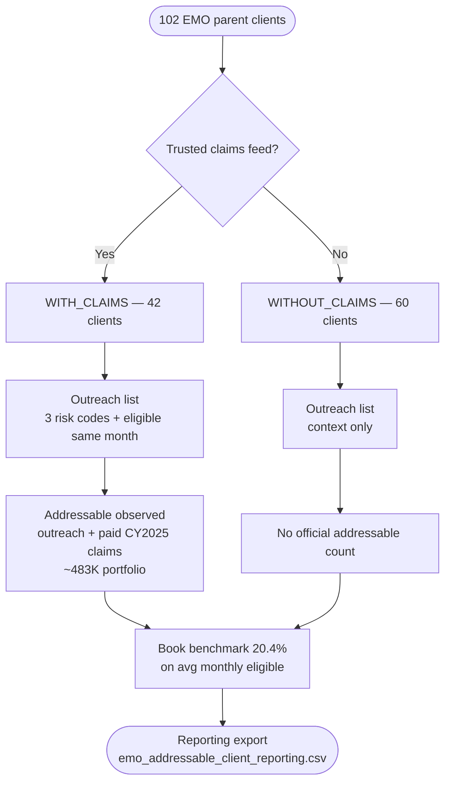

# EMO addressable population -- EDA results (CY2025)

---

## Summary (simplified)

| What | Rule |
|------|------|
| **Client segmentation** | **With claims** vs **without claims** client counts (102 EMO parents) |
| **Addressable population** | **With-claims clients only** — observed outreach + paid CY2025 claims |
| **Book benchmark (single metric)** | Portfolio addressable rate on avg monthly eligible across **all with-claims clients** — **20.4%** reference for without-claims directional estimates |
| **Without-claims clients** | No observed addressable in export; use **20.4%** x avg monthly eligible for directional sizing |

---

## Decision tree

### Text flow

```
START: 102 EMO parent clients
        |
        v
+-------------------------------+
| Has trusted claims feed?      |
+-------------------------------+
        |
   +----+----+
   |         |
  YES       NO
   |         |
   v         v
WITH_CLAIMS  WITHOUT_CLAIMS
(42 clients) (60 clients)
   |         |
   v         v
Outreach list          Outreach list
(3 risk codes +        (same rule; warehouse
 eligible same month)   counts for context only)
   |         |
   v         v
Addressable =          No observed addressable
outreach list +        (official export blank)
paid CY2025 claims
(OBSERVED per client)
   |         |
   +----+----+
        |
        v
Book benchmark (single rate):
with-claims addressable / with-claims avg monthly eligible
= 20.4% (reference for without-claims directional estimates)
```

### Mermaid



### Clients and members by branch

| Branch | Clients | Outreach list | Addressable population |
|--------|--------:|--------------:|-----------------------:|
| **With claims** | **42** | ~490K | **~483K** (observed) |
| **Without claims** | **60** | ~824 | Not sized in export |
| **Total** | **102** | ~491K | **~483K** (with-claims only) |

### What to use in each branch

| Branch | Addressable count | Rate |
|--------|-------------------|------|
| **With claims** | `n_addressable_recommended` (observed) | Client-specific `pct_addressable_recommended_on_avg_monthly_br` |
| **Without claims** | Directional: `n_avg_members_eligible` x **20.4%** | Book benchmark **`benchmark_pct_portfolio_weighted` = 20.4%** |

**Without-claims formula (directional only):**

```
estimated addressable = n_avg_members_eligible x 0.204
```

Example: Activision — 10,812 x 20.4% = ~2,200 members (not an observed warehouse count).

---

## Artifacts

| # | Artifact | Location |
|---|----------|----------|
| 1 | **This write-up** | [emo-addressable-population-eda-results.md](https://github.com/johnkimutai254/Evaluate-EMO-metric-benchmark-denominator-options/blob/main/emo-addressable-population-eda-results.md) |
| 2 | **Client-level sizing** | [emo_addressable_client_eda_*.csv](https://github.com/johnkimutai254/Evaluate-EMO-metric-benchmark-denominator-options/blob/main/emo_addressable_client_eda_2025-01-01_2026-01-01_20260622.csv) |
| 2a | **Book benchmark (single row)** | [emo_addressable_book_benchmark_*.csv](https://github.com/johnkimutai254/Evaluate-EMO-metric-benchmark-denominator-options/blob/main/emo_addressable_book_benchmark_2025-01-01_2026-01-01_20260622.csv) |
| 2b | **Clients by workstream (2 files)** | [emo_addressable_clients_with_claims_*.csv](https://github.com/johnkimutai254/Evaluate-EMO-metric-benchmark-denominator-options/blob/main/emo_addressable_clients_with_claims_2025-01-01_2026-01-01_20260622.csv), [emo_addressable_clients_without_claims_*.csv](https://github.com/johnkimutai254/Evaluate-EMO-metric-benchmark-denominator-options/blob/main/emo_addressable_clients_without_claims_2025-01-01_2026-01-01_20260622.csv) |
| 2c | **BR reporting table** | [query_data/emo_addressable/emo_addressable_client_reporting_*.csv](https://github.com/johnkimutai254/Evaluate-EMO-metric-benchmark-denominator-options/blob/main/emo_addressable_client_reporting_2025-01-01_2026-01-01_20260622.csv) |
| 3 | **Logic verification** | [emo-outreach-logic-verification.md](https://github.com/johnkimutai254/Evaluate-EMO-metric-benchmark-denominator-options/blob/main/emo-outreach-logic-verification.md) |
| 4 | **SQL** | [emo_nav_br/emo_addressable_eda.sql](https://github.com/johnkimutai254/Evaluate-EMO-metric-benchmark-denominator-options/blob/main/emo_addressable_eda.sql) |


---

## Analysis logic

**Member-first:** outreach identifies **members** → roll up to **EMO parent** → with-claims clients get **observed addressable** count.

| Step | Rule |
|------|------|
| **1. Outreach list** | `COMPLEX_PATIENTS`, `MSK_NEURO`, or `HIGH_COST` while eligible in same month |
| **2. Workstream** | `WITH_CLAIMS` / `WITHOUT_CLAIMS` (claims feed present or not) |
| **3. Addressable (official)** | **With-claims only:** outreach list + paid CY2025 claims |
| **4. Book benchmark** | Sum(addressable) / sum(avg monthly eligible) on **with-claims book** — one rate for reference |
| **5. Reporting** | `n_addressable_recommended` populated for with-claims only; blank for without-claims |

### Key export columns

| Column | Meaning |
|--------|---------|
| `client_workstream` | `WITH_CLAIMS` / `WITHOUT_CLAIMS` |
| `n_outreach_members` | Members on outreach list (all clients) |
| `n_addressable_paid` | Strict addressable — **with-claims only** |
| `n_addressable_recommended` | **Official sizing** — same as paid; **blank for without-claims** |
| `n_avg_members_eligible` | Primary eligible denominator (cEMO BR / `engagement.sql`) |
| `book_benchmark_pct_portfolio` | Single book-wide benchmark rate (same value every row) |
| `pct_addressable_recommended_on_avg_monthly_br` | Client rate; use for with-claims BR comparison |

---

## Portfolio summary (CY2025, run 2026-06-21)

| Metric | Value |
|--------|------:|
| Parent EMO accounts | 102 |
| **With-claims clients** | **42** |
| **Without-claims clients** | **60** |
| Avg monthly eligibles (all clients) | 4.13M |
| On outreach list (client sum) | ~491K |
| **Addressable (with-claims only)** | **~483K** |
| **Book benchmark (portfolio, with-claims)** | **~20.4%** of avg monthly eligible |

### By workstream

| | With claims | Without claims |
|--|------------:|---------------:|
| Clients | 42 | 60 |
| Outreach list | ~490K | ~824 |
| **Addressable (observed)** | **~483K** | **—** (not sized) |

---

## Book benchmark (single metric)

From `emo_addressable_book_benchmark_*.csv`:

| Field | Description |
|-------|-------------|
| `benchmark_pct_portfolio_weighted` | **Primary reference:** total addressable / total avg monthly eligible on with-claims book |
| `benchmark_pct_median_client` | Median of client-level rates (secondary) |
| `benchmark_pct_p25_client` / `p75` | Client-rate spread |

Use **`benchmark_pct_portfolio_weighted` (20.4%)** for without-claims directional estimates: `n_avg_members_eligible` x 0.204. Official export leaves `n_addressable_recommended` blank for without-claims rows.

---

## Worked examples (hand-off)

**BR default:** `n_avg_members_eligible` + `pct_addressable_recommended_on_avg_monthly_br` (with-claims clients only).

### Google — with claims

| Field | Value |
|-------|------:|
| Avg monthly eligible | 242,828 |
| Outreach list | 76,500 |
| **Addressable (official)** | **76,014** |
| Rate on avg monthly | **31.3%** |

**What to say:** "About 76K members (~31% of avg monthly eligibles) are addressable — observed in the warehouse."

### Activision — without claims

| Field | Value |
|-------|------:|
| Avg monthly eligible | 10,812 |
| Outreach list (warehouse) | 6 |
| **Addressable (official)** | **—** (not sized) |
| Book benchmark (reference) | ~20.4% portfolio on with-claims book |

**What to say:** "Activision has no claims feed — we do not publish an addressable count. Use the with-claims book benchmark (~20%) only as a directional reference, not client-specific sizing."

---

## With-claims: paid-claims filter

| Metric | Value |
|--------|------:|
| Outreach list (with-claims) | ~490K |
| Addressable paid | ~483K |
| Removed by filter | ~7K (~1.5%) |

Outreach list is usable as-is for with-claims targeting; strict addressable trims ~1.5%.
---
