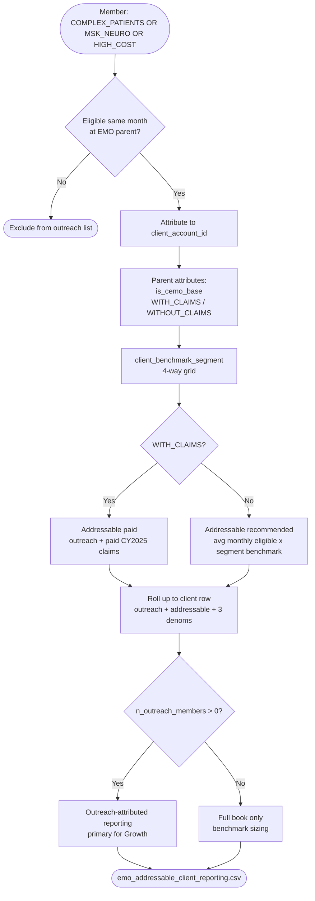

# EMO addressable population -- EDA results (CY2025)

---

## Artifacts

| # | Artifact | Location |
|---|----------|----------|
| 1 | **This write-up** | [emo-addressable-population-eda-results.md](https://github.com/johnkimutai254/Evaluate-EMO-metric-benchmark-denominator-options/blob/main/emo-addressable-population-eda-results.md) |
| 2 | **Client-level sizing** | [emo_addressable_client_eda_2025-01-01_2026-01-01_20260621.csv](https://github.com/johnkimutai254/Evaluate-EMO-metric-benchmark-denominator-options/blob/main/emo_addressable_client_eda_2025-01-01_2026-01-01_20260621.csv) |
| 2a | **Segment benchmarks** | [emo_addressable_segment_benchmarks_2025-01-01_2026-01-01_20260621.csv](https://github.com/johnkimutai254/Evaluate-EMO-metric-benchmark-denominator-options/blob/main/emo_addressable_segment_benchmarks_2025-01-01_2026-01-01_20260621.csv) |
| 2b | **Clients by segment (4 files)** | [emo_addressable_clients_with_claims__cemo_base_*.csv](https://github.com/johnkimutai254/Evaluate-EMO-metric-benchmark-denominator-options/blob/main/emo_addressable_clients_with_claims__cemo_base_2025-01-01_2026-01-01_20260621.csv), [..._with_claims__nav_plus_cemo_*.csv](https://github.com/johnkimutai254/Evaluate-EMO-metric-benchmark-denominator-options/blob/main/emo_addressable_clients_with_claims__nav_plus_cemo_2025-01-01_2026-01-01_20260621.csv), [..._without_claims__cemo_base_*.csv](https://github.com/johnkimutai254/Evaluate-EMO-metric-benchmark-denominator-options/blob/main/emo_addressable_clients_without_claims__cemo_base_2025-01-01_2026-01-01_20260621.csv), [..._without_claims__nav_plus_cemo_*.csv](https://github.com/johnkimutai254/Evaluate-EMO-metric-benchmark-denominator-options/blob/main/emo_addressable_clients_without_claims__nav_plus_cemo_2025-01-01_2026-01-01_20260621.csv) |
| 2c | **BR reporting table** | [emo_addressable_client_reporting_*.csv](https://github.com/johnkimutai254/Evaluate-EMO-metric-benchmark-denominator-options/blob/main/emo_addressable_client_reporting_2025-01-01_2026-01-01_20260621.xlsx) |
| 3 | **Logic verification** | [docs/emo-outreach-logic-verification.md](https://github.com/johnkimutai254/Evaluate-EMO-metric-benchmark-denominator-options/blob/main/emo-outreach-logic-verification.md) and [emo_outreach_logic_verification_*.csv](https://github.com/johnkimutai254/Evaluate-EMO-metric-benchmark-denominator-options/blob/main/emo_outreach_logic_verification_2025-01-01_2026-01-01_20260621.csv) |
| 4 | **SQL** | [emo_addressable_eda.sql](https://github.com/johnkimutai254/Evaluate-EMO-metric-benchmark-denominator-options/blob/main/emo_addressable.sql) |

---

## Analysis logic (addressable population)

**Member-first:** outreach identifies **members** → members roll up to **EMO parent** → parent carries `is_cemo_base` and claims flags → addressable → client reporting.

| Step | Rule |
|------|------|
| **1. Outreach list (members)** | `COMPLEX_PATIENTS`, `MSK_NEURO`, or `HIGH_COST` while eligible in same month |
| **2. Roll up to client** | `client_account_id`; attach `is_cemo_base`, `client_workstream` from parent package |
| **3. Segment** | `client_benchmark_segment` = claims x (`CEMO_BASE` \| `NAV_PLUS_CEMO`) |
| **4. Addressable** | WITH_CLAIMS: addressable paid; WITHOUT_CLAIMS: avg monthly eligible x segment benchmark |
| **5. Reporting** | Client row with 3 eligibility denominators; filter `n_outreach_members > 0` for outreach-attributed view |

### BR reporting table columns (`emo_addressable_client_reporting_*.csv`)

| Column | Meaning |
|--------|---------|
| `client_account_name` | EMO parent |
| `is_cemo_base` | Core EMO only (TRUE) vs Nav + Core EMO (FALSE) |
| `client_benchmark_segment` | Four-way segment for benchmarking |
| `client_workstream` | `WITH_CLAIMS` / `WITHOUT_CLAIMS` |
| `n_outreach_members` | Members on Allison outreach list |
| `n_addressable_paid` | Outreach + paid CY2025 claims (observed) |
| `n_addressable_recommended` | **Official sizing field** |
| `n_eligible_distinct_members` | Denom A: anyone eligible any month in CY2025 |
| `n_avg_members_eligible` | Denom B: **avg monthly eligible (BR funnel)** |
| `n_eop_members_eligible` | Denom C: Dec 2025 eligible snapshot |
| `pct_*_on_distinct_ever` | Rates using Denom A |
| `pct_*_on_avg_monthly_br` | Rates using Denom B (align with cEMO BR) |
| `pct_*_on_eop_dec` | Rates using Denom C |

Use **`pct_addressable_recommended_on_avg_monthly_br`** when comparing to cEMO BR funnel rates.

---

## What we set out to do

We ran a segmented EDA on the CY2025 EMO book to size the addressable population for outreach -- split by clients **with claims** vs **without claims**, and by **base cEMO** vs **Nav + Core EMO**, because those cohorts behave differently in the warehouse and in reporting.

We rebuilt Allison Kim's outreach list from three risk assessments while eligible in the same calendar month: `COMPLEX_PATIENTS`, `MSK_NEURO`, and `HIGH_COST`. For clients with claims, we tested whether adding a paid-claims filter meaningfully changes the pool. For clients without claims, we benchmarked against **with-claims peers in the same segment** using the **avg monthly eligible** denominator (Core EMO funnel).

---

## What we found

### Portfolio summary

| Metric | Value |
|--------|------:|
| Parent EMO accounts | 102 |
| Base cEMO clients (`is_cemo_base`) | 89 |
| Nav + Core EMO clients (`has_nav`) | 13 |
| CY2025 eligibles (avg monthly -- primary) | 4.13M |
| CY2025 eligibles (distinct ever-eligible) | 3.22M |
| On Allison's outreach list (warehouse, client sum) | 491K |
| **Recommended addressable** | **858K** |
| Recommended as % of avg monthly eligible | 20.8% |
| Observed addressable (with-claims only) | 483K |

### Primary denominator (what EMO reporting uses)

**Benchmarking and recommended sizing use avg monthly eligible** (`n_avg_members_eligible`) -- the same denominator as Core EMO funnel reporting in `engagement.sql`.

| Denominator | Column | Portfolio total |
|-------------|--------|----------------:|
| **Avg monthly eligible (primary)** | `n_avg_members_eligible` | **4.13M** |
| Distinct ever-eligible | `n_eligible_distinct_members` | 3.22M |
| End-of-period eligible (Dec 2025) | `n_eop_members_eligible` | 3.99M |

### Denominator comparison (portfolio)

Same numerators across all three denominators (outreach list, strict addressable, recommended addressable):

| Denominator | Portfolio total | % on outreach list | % addressable (strict) | % addressable (recommended) |
|-------------|----------------:|-------------------:|-----------------------:|----------------------------:|
| Distinct ever-eligible | 3.22M | 15.2% | 15.0% | 26.7% |
| **Avg monthly eligible (primary)** | **4.13M** | **11.9%** | **11.7%** | **20.8%** |
| End-of-period eligible (Dec 2025) | 3.99M | 12.3% | 12.1% | 21.5% |

### Segment grid: addressable by claims x base cEMO

| Segment | Clients | Avg monthly eligibles | Outreach list | Addressable (strict) | **Recommended addressable** | Benchmark median |
|---------|--------:|----------------------:|--------------:|---------------------:|----------------------------:|-----------------:|
| `WITH_CLAIMS__CEMO_BASE` | 32 | 993K | 211K | 207K | **207K** | observed |
| `WITH_CLAIMS__NAV_PLUS_CEMO` | 10 | 1.37M | 279K | 276K | **276K** | observed |
| `WITHOUT_CLAIMS__CEMO_BASE` | 57 | 1.64M | 658 | 0 | **341K** | 20.8% |
| `WITHOUT_CLAIMS__NAV_PLUS_CEMO` | 3 | 133K | 166 | 0 | **35K** | 26.2% |
| **Portfolio** | **102** | **4.13M** | **491K** | **483K** | **858K** | -- |

**Segment benchmark rates** (from with-claims peers, `pct_addressable_on_avg_eligible`):

| Benchmark segment | With-claims clients | Median | p25 | p75 |
|-------------------|--------------------:|-------:|----:|----:|
| `CEMO_BASE` | 32 | **20.8%** | 13.9% | 23.8% |
| `NAV_PLUS_CEMO` | 10 | **26.2%** | 23.3% | 28.5% |

**No-claims planning bands** (avg monthly eligibles x segment p25-p75):

| Segment | Recommended (median) | p25 - p75 band |
|---------|---------------------:|---------------:|
| `WITHOUT_CLAIMS__CEMO_BASE` | 341K | 227K - 389K |
| `WITHOUT_CLAIMS__NAV_PLUS_CEMO` | 35K | 31K - 38K |

### Results by workstream

| | With claims | Without claims | **Total** |
|---|------------:|---------------:|----------:|
| Parent accounts | 42 | 60 | **102** |
| Avg monthly eligibles | 2.36M | 1.77M | **4.13M** |
| On outreach list | 490K | 824 | -- |
| Observed addressable (strict) | **483K** | 0 | **483K** |
| **Recommended addressable** | **483K** | **376K** | **858K** |
| How sized | Observed in warehouse | Segment benchmark x avg monthly eligible | Mixed |
| % recommended / avg monthly eligible | 20.4% | 21.2% | 20.8% |

### With-claims clients: does a paid-claims filter change the pool?

| Metric | Value |
|--------|------:|
| Members on outreach list | 490K |
| Members with outreach + paid claims in CY2025 | 483K |
| Members removed by claims filter | 7.1K (1.5%) |
| Share of outreach list with paid CY2025 claims | 98.5% |

### Typical client rates (with-claims only)

Median = typical client (not lives-weighted). Portfolio = lives-weighted across with-claims clients.

| Rate | Denominator | Median across clients | Portfolio (lives-weighted) |
|------|-------------|----------------------:|---------------------------:|
| % on outreach list | Distinct ever-eligible | 19.6% | 17.6% |
| % addressable (strict) | Distinct ever-eligible | 19.3% | 17.4% |
| % on outreach list | **Avg monthly eligible** | **22.3%** | **20.8%** |
| % addressable (strict) | **Avg monthly eligible** | **22.0%** | **20.4%** |
| % on outreach list | End-of-period eligible | 22.6% | 21.3% |
| % addressable (strict) | End-of-period eligible | 22.1% | 20.9% |

### No-claims examples: warehouse list vs recommended sizing

| Client | Segment | On outreach list | Recommended addressable |
|--------|---------|-----------------:|------------------------:|
| Wellmark, Inc. | `WITHOUT_CLAIMS__CEMO_BASE` | 0 | **271K** |
| Humana Employees | `WITHOUT_CLAIMS__NAV_PLUS_CEMO` | 94 | **27K** |
| Genentech | `WITHOUT_CLAIMS__CEMO_BASE` | 194 | **13K** |

### Summary notes

- **Headline:** About **858K members** recommended addressable for CY2025 -- **483K** observed on with-claims clients and **376K** estimated on without-claims clients using segment benchmarks on **avg monthly eligible**.
- **With claims:** Allison's list is effectively ready to use. A paid-claims filter only trims **~1.5%** because **98.5%** of outreach-list members already have paid claims in CY2025.
- **Without claims:** Do not use the warehouse outreach count (**824**) for sizing. Use **`n_addressable_recommended`** with the segment benchmark (`benchmark_median_pct` in the export).
- **Segment benchmarking:** `CEMO_BASE` without-claims clients benchmark at **20.8%**; `NAV_PLUS_CEMO` without-claims at **26.2%** -- not one book-wide rate.
- **Wellmark drives no-claims volume:** Largest recommended addressable account (**271K**) is a no-claims base cEMO client with **zero** warehouse outreach members -- review before external use.
- **Outreach list nationally:** **491K** member slots summed per client (some `entity_id`s appear under more than one parent account).

---

## Where volume concentrates

**Observed (with-claims):** Wells Fargo (**93K**), Google (**76K**), AT&T (**73K**), Charter (**54K**), Target (**40K**), Southwest (**39K**).

**Recommended (includes estimates):** Wellmark (**271K**, no-claims), then Wells Fargo, Google, AT&T, Charter, Target. Sort the export by `n_addressable_recommended` for the full ranking.

---

## What's driving the outreach list

Outreach rule is an OR across three codes. Portfolio-wide, `MSK_NEURO` is the largest contributor (**approx.382K** member-slots), followed by `HIGH_COST` (**approx.225K**) and `COMPLEX_PATIENTS` (**approx.68K**). Those counts overlap.

On no-claims clients, warehouse outreach is only **824** members -- risk flags that need claims barely fire without a claims feed.

---

## Claims in the outreach logic

**Outreach selection** is three risk codes plus eligibility -- no separate claims filter in the rule.

**Flag assignment** is claims-driven for `MSK_NEURO` and `HIGH_COST`, and mostly claims-driven for `COMPLEX_PATIENTS`. That matches **98.5%** overlap between outreach list and paid CY2025 claims on with-claims clients.

---

## How to use the client export

**For BR / stakeholder reporting:** use `emo_addressable_client_reporting_*.csv`.

**For full warehouse fields:** use `emo_addressable_client_eda_*.csv`.

The official sizing field is **`n_addressable_recommended`**.

| Workstream | Logic |
|------------|-------|
| **With claims** | Observed strict addressable (`n_addressable_paid`) |
| **Without claims** | `n_avg_members_eligible` x segment `benchmark_median_pct` |

Compare denominators using the three eligible columns and `pct_*_on_distinct_ever` / `pct_*_on_avg_monthly_br` / `pct_*_on_eop_dec` in the reporting table.

---

## Examples

Two clients from run `20260621` illustrate the two sizing paths. Use **[emo_addressable_client_reporting_*.csv](https://github.com/johnkimutai254/Evaluate-EMO-metric-benchmark-denominator-options/blob/main/emo_addressable_client_reporting_2025-01-01_2026-01-01_20260621.xlsx)** to look up any other client the same way.

**BR default:** use **`n_avg_members_eligible`** and **`pct_addressable_recommended_on_avg_monthly_br`** so addressable rates align with cEMO engagement funnel (`engagement.sql`).

### Side-by-side

| | **Google** | **Activision Blizzard, Inc.** |
|--|------------|----------------------------------|
| Segment | `WITH_CLAIMS__NAV_PLUS_CEMO` | `WITHOUT_CLAIMS__CEMO_BASE` |
| Core EMO only? | No (Nav + cEMO) | Yes (`is_cemo_base`) |
| Claims feed? | Yes | No |
| Avg monthly eligible | **242,828** | **10,812** |
| On outreach list | **76,500** (31.5%) | **6** (0.06%) |
| Addressable paid (observed) | **76,014** (31.3%) | **0** |
| **Official addressable** | **76,014** | **2,252** |
| How sized | Counted in warehouse | 10,812 x 20.8% peer benchmark |
| Benchmark source | N/A (observed) | Median of 32 with-claims base cEMO peers |

### Google — with claims (observed sizing)

Google has a claims feed, so we **count** addressable members in the warehouse.

1. **Outreach list:** 76,500 members with `COMPLEX_PATIENTS`, `MSK_NEURO`, or `HIGH_COST` while eligible in the same month (~31.5% of avg monthly eligibles).
2. **Addressable paid (strict):** 76,014 of those also have paid CY2025 claims. Only **486** members drop off (~0.6%) — the outreach list is already claims-informed.
3. **Official size:** `n_addressable_recommended` = **76,014** (= `n_addressable_paid` for with-claims clients).
4. **BR rate:** `pct_addressable_recommended_on_avg_monthly_br` = **31.3%** — use this next to engagement/utilization on the same eligible base.

"Google has ~243K avg monthly eligibles. ~76K (~31%) are addressable for EMO outreach — observed in the warehouse, not estimated."

### Activision — without claims (benchmark sizing)

Activision has **no** trusted claims feed. Warehouse outreach is tiny and **not** used for sizing.

1. **Outreach list (warehouse):** only **6** members (~0.06% of eligibles) — flags that need claims barely fire without a claims feed.
2. **Addressable paid:** **0** — strict observed addressable is not measurable.
3. **Benchmark:** borrow the median addressable rate from **with-claims base cEMO peers** (`WITH_CLAIMS__CEMO_BASE`): **20.8%** (`benchmark_median_pct`).
4. **Official size:** `n_addressable_recommended` = 10,812 x 20.8% = **2,252**.
5. **BR rate:** `pct_addressable_recommended_on_avg_monthly_br` = **20.8%** (by construction from the benchmark).

 "Activision doesn’t have claims in the warehouse, so we estimate **~2,250 addressable members** using the base cEMO with-claims peer median (~21% of avg monthly eligibles). Do not cite the 6 warehouse outreach members as the addressable pool."

### Reading `pct_*` on these two clients

| Field | Google | Activision |
|-------|-------:|-----------:|
| `pct_outreach_on_avg_monthly_br` | 31.5% | 0.06% |
| `pct_addressable_paid_on_avg_monthly_br` | 31.3% | 0% |
| `pct_addressable_recommended_on_avg_monthly_br` | **31.3%** | **20.8%** |

- **Google:** recommended % ≈ observed paid %.
- **Activision:** recommended % = benchmark %; outreach % is near zero and misleading for sizing.

### Which export columns to use (any client)

| Need | Column |
|------|--------|
| Headline addressable count | `n_addressable_recommended` |
| BR-aligned rate | `pct_addressable_recommended_on_avg_monthly_br` |
| BR-aligned eligible base | `n_avg_members_eligible` |
| Segment / peer group | `client_benchmark_segment`, `benchmark_source_segment` |
| Warehouse outreach (context only) | `n_outreach_members` |

---

## How we built it

1. **Universe:** EMO parent accounts on the SALES book, account-level, CY2025.
2. **Outreach list:** `member_risk_assessments.history:v1` -- any of the three codes in an eligible month.
3. **With-claims addressable:** outreach list intersected with paid claims in CY2025 (`member_spend_rolling_12_months:v3`).
4. **Without-claims addressable:** `n_avg_members_eligible` x segment benchmark `pct_addressable_on_avg_eligible` from matching with-claims segment.
5. **Segments:** `client_benchmark_segment` = `{WITH_CLAIMS|WITHOUT_CLAIMS}__{CEMO_BASE|NAV_PLUS_CEMO}`.
6. **Primary denominator:** avg monthly eligible (`client_account_partition_monthly_total_lives`); also export distinct ever-eligible and end-of-period eligible.

---

## Open questions

| Question | Recommendation|
|----------|-----------------|
| Use Allison's list as-is on with-claims clients? | Yes -- claims filter barely moves the count |
| How to size without-claims clients? | `n_addressable_recommended` by segment, not warehouse outreach |
| Accounts to spot-check? | **Wellmark** (large no-claims estimate, zero outreach), **Schwan's** and **Avergent** (with-claims outreach vs paid-claims gap) |

---

## Limitations

Addressable here means **targeting pool**, not engaged or converted members. Portfolio totals sum at the client level -- planning numbers, not a deduplicated national headcount. No-claims estimates are directional and assume peers in the same segment are comparable. **Wellmark** and other large no-claims accounts can dominate the recommended total. Medians describe a typical client; large employers drive portfolio totals.

---
